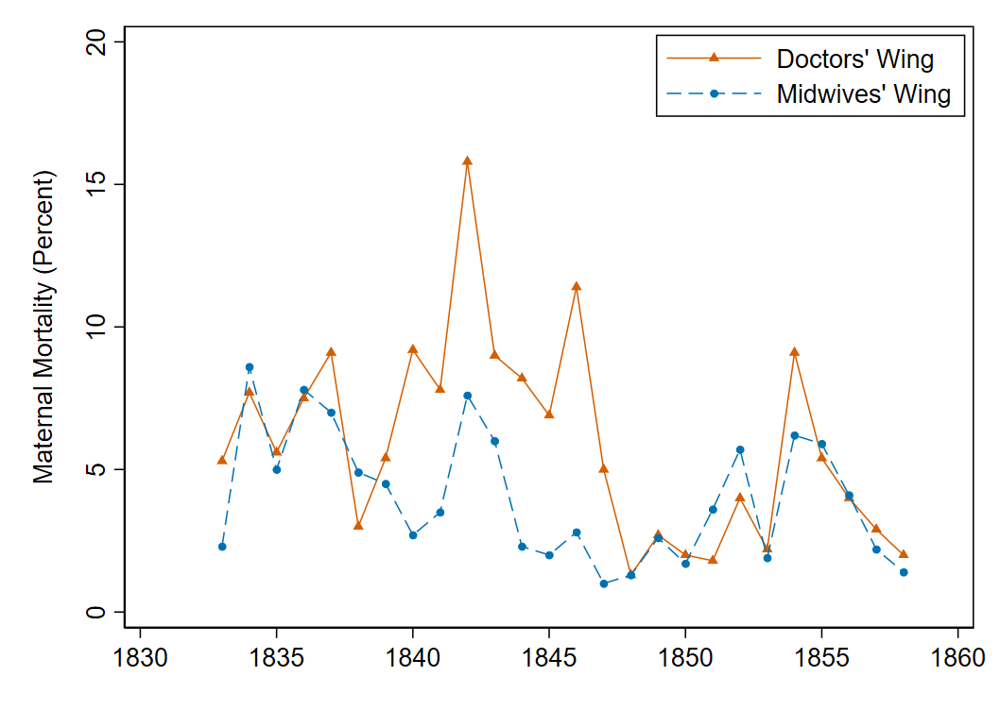

# Empirical Exercise 3
   
In this exercise, we're going to analyze data from Ignaz Semmelweis' handwashing intervention in the maternity hospital in Vienna.  The data come from 
Semmelweis' (1861) book, and [some helpful person put them on Wikipedia](https://en.wikipedia.org/wiki/Historical_mortality_rates_of_puerperal_fever#Yearly_mortality_rates_for_birthgiving_women_1784%E2%80%931849).  

We'll review the different ways to estimate simple difference-in-differences models.  We'll also learn how to make simple graphs using `twoway` and export regression results using the  `esttab` and `putexcel` commands.  `putexcel` is more customizable, but it also takes more work. `esttab` is a very straightforward tool for getting basic regression results out of stata and into pretty much any format.   

Additional tips on using Stata for data visualization are available [here](https://pjakiela.github.io/stata/dataviz.html).  Tips on making tables are available [here](https://pjakiela.github.io/stata/making-tables.html).  
  
<br> 

## Getting Started  

Data on maternal mortality rates in Vienna are contained in the Excel file [E3-Semmelweis1861-data.xlsx](E3-Semmelweis1861-data.xlsx). The spreadsheet inlcudes annual data from 1833 (when the Vienna Maternity Hospital opened its second clinic) through 1858.  Mortality rates are reported for Division 1 
(where expectant mothers were treated by doctors and medical students) and Division 2 (where expectant mothers were treated by midwives and trainee midwives from 1841 on). In Semmelweis' difference-in-differences analysis, Division 1 was the (ever-)treated group.  

Our first task is to import this Excel file into Stata using the `import excel` command.  Create a do file that begins with the usual 
preliminaries and then imports the Semmelweis data directly from github using the following code:
```
import excel ///
"https://pjakiela.github.io/ECON523/exercises/E3-Semmelweis1861-data.xlsx", /// 
sheet("ViennaBothClinics") first
```
The option `sheet` tells Stata which worksheet within the excel file `E3-Semmelweis1861-data.xlsx` to select.  The option `first` indicates that the first row of the spreadsheet should be treated as variable names and not as one of the observations.  

After importing the data, assign the variables the following labels using the `label var` command:

| Variable | Label to Assign |
|------------|------------|
| Births1 | Births in Division 1 (Treatment Group) |
| Deaths1 | Deaths in Division 1 (Treatment Group) |
| Rate1 | Mortality Rate in Division 1 (Treatment Group) |
| Births2 | Births in Division 2 (Comparison Group) |
| Deaths2 | Deaths in Division 2 (Comparison Group) |
| Rate2 | Mortality Rate in Division 2 (Comparison Group) |

Now familiarize yourself with the data set. What is the average maternal mortality rate in Division 1?  What is the average maternal mortality rate in Division 2?

<br>

## In-Class Activity

### Question 1

Use stata's `twoway` command to make a graph of maternal mortality in the two wings of the hospital. First, if you have not already, install the `blindschemes` packing by running the command:
```
ssc install blindschemes
```
This will allow you to use the colors `sea` and `vermillion` from the Okabe-Ito colorblind-friendly palette, as shown in the sample code. Adapt the code to make your graph as close possible to the one below.
```
twoway (connected Rate1 Year, ///
	color(vermillion) msymbol(o) msize(small) lw(thin)) /// 
	(connected Rate2 Year, ///
	color(sea) msymbol(o) msize(small) lw(thin)), ///
	xlabel(1830(5)1860) xtitle(" ") ///
	legend(label(1 "Doctors' Wing") ///
	label(2 "Midwives' Wing") ///
	col(2) ring(0) pos(2))
```
Your finished graph should look something like this:  



What patterns do you notice in this figure?  How do maternal mortality rates in the two divisions of the hospital compare?  

### Question 2

In what year did the hospital first move to the system where patients in Division 1 were treated by doctors and patients in Division 2 were treated by midwives?  Drop the observations (years) before this happened using the drop command.

Hint: use the `list` command to list the the notes contained in the data set by year.  If you only want to list the rows of data that include a note (i.e. where the `Note` variable is non-missing), you can add `!missing(Note)` at the end of the command.  

### Question 3

Generate a `post` variable equal to one for years after the handwashing policy was implemented (and zero otherwise).  

### Question 4

What is the mean postpartum mortality rate in the doctors' wing (Division 1) prior to the implementation of the handwashing policy?

### Question 5

Now we're going make a table showing the difference-in-differences estimate of the treatment effect of hand washing on maternal mortality. The table 
will show the mean mortality rate (maternal deaths per 100 births) in the Treatment and Comparison wings before and after Semmelweis' policy was implemented. Your table will look something like this, except with the actual means, standard errors, and differences instead of ones and zeroes:  

|             | Treatment | Comparison | Difference | 
|-------------|-----------|---------|------------|
| Before Handwashing | 1.00 | 1.00 | 1.00 |
| | (0.00) | (0.00) | (0.00) |
| After Handwashing | 1.00 | 1.00 | 1.00 |
| | (0.00) | (0.00) | (0.00) |
| Difference | 1.00 | 1.00 | 1.00 |
| | (0.00) | (0.00) | (0.00) |


We'll write to an excel file using the `putexcel` command .  `putexcel` is a simple command that allows you to write Stata output to a particular cell or set of cells in an excel file.  Before getting started with `putexcel`, use the `pwd` ("print working directory") command to make sure that you are writing your results to an appropriate folder.  Use `cd` to change your file path if necessary.  Then set up the excel file that will receive your results using the commands:

```
putexcel set E3-DD-table1.xlsx, replace
putexcel B1="Treatment", hcenter bold border(top)
putexcel C1="Comparison", hcenter bold border(top)
putexcel D1="Difference", hcenter bold border(top)
putexcel A2="Before Handwashing", bold
putexcel A4="After Handwashing", bold
```

You will also want to set the widths of the columns in your Excel file. Unfortunately, there is no way to do this using `putexcel`. The code below invokes stata’s mata programming language to adjust the column widths. Change the parameter values as needed to create a professional-looking table.  
```
mata
b = xl()
b.load_book("E3-DD-table1.xlsx")
b.set_sheet("Sheet1")
// make variable name column widest
b.set_column_width(1,1,20) 
// width for subsequent columns
b.set_column_width(2,4,12) 
// row heights
b.set_row_height(2,7,20)
b.set_row_height(2,7,20)
// make headers bold
cols = (1,4)
b.set_font_bold(1, cols, "on")
// top and bottom borders
b.set_bottom_border(7, cols, "thin")
b.set_top_border(1, cols, "thin")
b.set_top_border(2, cols, "thin")
b.close_book()
end
```

At this point, it is worth opening your excel file to make sure that you are writing to it successfully.  **Be sure to close the file after you look at it**; Stata won't write over an open file.  The column and row labels should all appear in bold font; the column headings in cells B1, C1, and D1 should be centered; and the table should have borders at the top and bottom.  

### Question 6

Now that we know that `putexcel` is working, we can add the mean of the variable `Rate1` (the maternal mortality rate in Division 1) for the years prior to the introduction of handwashing.  You can use the `return list` command after a command like `summarize` to see what statistics the summarize command stored in Stata's short-term memory as locals.  Any of these statistics can be exported to Excel.  

```
sum Rate1 if post==0
return list
```

We're going to put the mean maternal mortality rate in Division 1 prior to the handwashing intervention in cell B2:  the **Treatment** column, in the **Before Handwashing** row.

```
local temp_mean = string(r(mean),"%03.2f")
putexcel B2=`temp_mean', hcenter 
```

The `string` command in the first line creates a local macro containing a string that is the mean calculated the last time you used the `summarize` command, rounded to 2 decimal places.  The second line writes that local macro in our Excel file.  Notice that the local macro being exported to Excel appears in single quotes.  If you are just writing a local macro to Excel using the `putexcel` command, it does not need to appear in (double) quotes, but sequences of letters and numbers do need double quotes.  The `hcenter` option tells Excel to center the number within the column.  

### Question 7

We can calculate the standard error of the mean by taking the standard deviation (reported by the `sum` command) and dividing it by the square root of the number of observations (also reported by the `sum` command).  What is the standard error of the mean postpartum mortality rate in the doctors' wing prior to Semmelweis' handwashing intervention?  Use the code below to add this to your table.

```
local temp_se = string(r(sd)/sqrt(r(N)),"%03.2f")
putexcel B3="(`temp_se')", hcenter 
```

### Question 8

We can also use the `ci means` command to calculate the mean and standard error of a variable.  Use 
`return list` to see what statistics are saved after `ci means`.  Use `ci means` and `putexcel` to add 
the mean and standard error of `Rate1` in the post-treatment period to your table.

### Question 9

Calculate the difference (between the mean of `Rate1` in the pre-treatment period and the mean of `Rate1` in the post-treatment period) and the associated standard error by hand using the formula (and the `display` command).

### Question 10

Now confirm that you get the same result using the `ttest` command.  How would you export the results of the `ttest` command into your table using `putexcel`?

### Question 11 

Now complete the table. 

<br> 

## Empirical Exercise

Next, we are going to implement difference-in-differences as a regression. Create a do file that reads in Semmelweis' data from github and restricts attention to the period 
when doctors worked in the first clinic and midwives worked in the second clinic.  Your do file should start with the usual preliminaries, just like your do file 
for the in-class activity. 

### Question 1 

Generate a `post` variable equal to one for years after the handwashing policy was implemented (and zero otherwise), and then generate a `diff` variable equal to the difference in mortality rates between Clinic 1 (treatment) and clinic 2 (control). Regress `diff` on `post`. Use the command `eststo clear` immediately **before** your regression command, and then use the command `eststo` (short for "estimates store") immediately after. This will save your regression results. Then display your results with `esttab` with the `se` (standard error) option (`esttab, se`). What is the coefficient on `post`, which is the difference-in-difference-in-differences estimate of the treatment effect of handwashing? What is the associated standard error? What is the t-statistic?

### Question 2

Use the `reshape` command (illustrated below) to convert your data into a panel data set containing a variable `Rate` and a variable `clinic` that indicates whether an observation comes from Clinic 1 (doctors) or Clinic 2 (midwives).  How many observations are there in the data set now?  How many from each clinic?  
```
reshape long Rate, j(clinic) i(Year)
```

### Question 3

Generate a `treatment` variable equal to one for the doctors' wing (and zero otherwise). Then generate the interaction term you need to estimate a difference-in-differences model in a regression framework.

### Question 4

Use the `label variable` command to give your variables short, easy to interpret labels. I suggest the following:

| Variable | Label to Assign |
|------------|------------|
| treatment | Treatment clinic |
| post | Handwashing implemented (post) |
| txpost | Treatment*post |

### Question 5

Implement (standard 2x2) difference-in-differences in an OLS regression framework.  Use the command `eststo clear` immediately before your `regression` command, and then use the command `eststo` (estimates store) to save your results. What is the coefficient on your `txpost` (`treatment` x `post`) variable? what is the standard error?  

### Question 6

Now implement differences in differences while controlling for year fixed effects: omit the `post` variable from your regression, and instead include `i.Year` to generate and include year fixed effects. Use `eststo` to store your results (do not use `eststo clear` first because you want to store the results from both regressions). What is the coefficient on your `txpost` variable? what is the standard error?  Did including fixed effects improve the precision of your estimates?

### Question 7

Use the `esttab` command to make a table of your regression results, and then use `esttab using clinic-regs.rtf` to save your table as a word (rtf) document. Look through the `esttab` options to make your table look more professional. Report standard errors rather than t-statistics in parentheses below your coefficients. Have your variable labels appear in place of variable names, and make sure your first column is wide enough to accommodate the labels you have given your variables. Make the columns with your regression coefficients say OLS at the top using `esttab`'s `mtitle` option. Adding `indicate(Year Fixed Effects = *.Year)` will tell `esttab` to omit the coefficients on the fixed effects and instead indicate where they are included. You can learn more about making tables in `esttab` [here](https://pjakiela.github.io/stata/regression-table.html). Export your finished table to word and then save it as a pdf so that you can upload it to gradescope.

**Optional.** If you want to make a fully customizable table using `putexcel`, you can instead run your regressions, store the results in new stata variables that you create, and export those to excel, as follows:
```
reg Rate treatment post txpost
mat V = r(table)
mat list V
```
You see that you have your regression results stored in the matrix `V`. You could use `putexcel` to write those results one coefficient at a time, or you could create the column of results that you want in your table as a variable and then export it, like this:
```
gen results = ""
replace results = string(V[1,1],"%03.2f") in 1 
replace results = string(V[2,1],"%03.2f") in 2
replace results = string(V[1,2],"%03.2f") in 3 
replace results = string(V[2,2],"%03.2f") in 4
replace results = string(V[1,3],"%03.2f") in 5 
replace results = string(V[2,3],"%03.2f") in 6
replace results = string(V[1,4],"%03.2f") in 7 
replace results = string(V[2,4],"%03.2f") in 8 
replace results = "(" + results + ")" if mod(_n,2)==0 & results!=""
putexcel set E3-DD-regs.xlsx, replace
putexcel B1="(1)", hcenter bold border(top)
putexcel B2="OLS", hcenter bold border(bottom)
export excel results using E3-DD-regs.xlsx, cell(B3) sheet("Sheet1", modify)
```
Extend the code so that you end up with a nicely formatted regression table containing the results of both regressions, complete with variable labels, borders, etc. You can also use a similar approach to export your results to latex, if you prefer.  

### Question 8

When you upload your do file to gradescope, you will be asked to answer the following questions about your results:

- Which coefficient in the regression table (i.e. the coefficient on which variable) is the difference-in-differences estimate of the treatment effect of handwashing on maternal mortalty?
- Which regression coefficient is the estimate of the degree of selection bias?
- Which regression coefficient is the estimate of the time trend in the absence of treatment?
- In one sentence, explain how adding fixed effects changed the precision of your difference-in-difference estimate of the impact of handwashing.


 ---
 
This exercise is part of [Module 3:  Difference-in-Differences 1](https://pjakiela.github.io/ECON523/M3-DD1.html).
