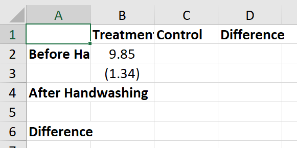

# Empirical Exercise 3
   
In this exercise, we're going to analyze data from Ignaz Semmelweis' handwashing intervention in the maternity hospital in Vienna.  The data come from 
Semmelweis' (1861) book, and [some helpful person put them on Wikipedia](https://en.wikipedia.org/wiki/Historical_mortality_rates_of_puerperal_fever#Yearly_mortality_rates_for_birthgiving_women_1784%E2%80%931849). 
We'll be reading them in from Excel using the `import excel` command.

We're going to be exporting estimation results to Excel using the `putexcel` command, and we'll also be making figures.  Before doing so, 
make sure you have the `blindschemes` package installed.  To do this, type `findit blindschemes` in the Stata command window.  When you do, 
a window that looks like this will pop up:


  
Click the first link, and then scroll down until you see the blue text that says **click here to install**.  That should install the `blindschemes package.  
  
<br> 

## Getting Started  

Data on maternal mortality rates in Vienna are contained in the Excel file [E3-Semmelweis1861-data.xlsx](E3-Semmelweis1861-data.xlsx).  The spreadsheet 
inlcudes annual data from 1833 (when the Vienna Maternity Hospital opened its second clinic) through 1858.  Mortality rates are reported for Division 1 
(where expectant mothers were treated by doctors and medical students) and Division 2 (where expectant mothers were treated by midwives and trainee midwives from 1841 on). 
In Semmelweis' difference-in-differences analysis, Division 1 was the (ever-)treated group.  

Our first task is to import this Excel file 
into Stata using the `import excel` command.  The `do` file [`E3-in-class.do`](E3-in-class.do) does this:  after the usual top-of-the-do-file preliminaries, it includes the 
command:

```
import excel using E3-Semmelweis1861-data.xlsx, ///
   sheet("ViennaBothClinics") first
```

The option `sheet` tells Stata which worksheet within the Excel file `E3-Semmelweis1861-data.xlsx` to select.  The option 
`first` indicates that the first row of the spreadsheet should be treated as variable names and not as one of the observations.  

After importing the data, the `do` file then adds labels to all the variables using the `label variable` command (which can be 
abbreviated as `la var`).  Use the `describe` and `summarize` commands to familiarize yourself with the data set.  Which variable 
records the maternal mortality rate in Division 1 of the hospital?  What is the average maternal mortality rate in Division 1?  What is 
the average maternal mortality rate in Division 2?

The next lines of the code in the `do` file save the data in Stata format, and then graph maternal mortality rates in Division 1 
and Division 2.  If you have important the data correctly and installed the `blindschemes` package, Stata should generate a figure that looks like this:


What patterns do you notice in this figure?  How do maternal mortality rates in the two divisions of the hospital compare?

Use the `list` command to list the the notes contained in the data set by year.  If you only want to list the rows of data 
that include a note (i.e. where the `Note` variable is non-missing), you can add `if Note!=""` at the end of the command.  

In what year did the hospital first move to the system where patients in Division 1 were treated by doctors and patients in Division 2 
were treated by midwives?  Drop the observations (years) before this happened using the drop command.

_Make sure that you record this and all your subsequent commands in your do file, so that you can re-run your code later._

Generate a `post` variable equal to one for years after the handwashing policy was implemented (and zero otherwise).  What is the mean 
postpartum mortality rate in the doctors' wing (Division 1) prior to the implementation of the handwashing policy?

Now let's put this result in a table!  We're going to use the `putexcel` command to write our results into an Excel file.  `putexcel` 
is a simple command that allows you to write Stata output to a particular cell or set of cells in an Excel file.  Before getting started 
with `putexcel`, use the `pwd` ("print working directory") command in the Stata command window to make sure that you are writing your 
results to an appropriate file.  Use the `cd` command to change your file path if necessary.  Then set up the Excel file that will 
receive your results using the commands:

```
putexcel set E3-DD-table1.xlsx, replace
putexcel B1="Treatment", hcenter bold border(top)
putexcel C1="Control", hcenter bold border(top)
putexcel D1="Difference", hcenter bold border(top)
putexcel A2="Before Handwashing", bold
putexcel A4="After Handwashing", bold
```

At this point, it is worth opening your Excel file to make sure that you are writing to it successfully.  **Be sure to close the file after you look at it**; Stata won't write over an open Excel file.  The column and row labels should all appear in bold font (the `bold` option), and the column headings in cells B1, C1, and D1 should be centered (the `hcenter` option) and have a border above them (the `border()` option).  

Now that we know that `putexcel` is working, we can add the mean of the variable `Rate1` (the maternal mortality rate in Division 1) for the years prior to the introduction of handwashing.  Remember that you can always use the `return list` command after a command like `summarize` to see what statistics the summarize command stored in Stata's short-term memory as locals.  Any of these statistics can be exported to Excel.  We're going to put the mean maternal mortality rate in Division 1 prior to the handwashing intervention in cell B2:  the **Treatment** column, in the **Before Handwashing** row.

```
sum Rate1 if post==0
return list
putexcel B2=`r(mean)', hcenter nformat(#.##)
```

Notice that the local macro being exported to Excel appears in single quotes.  If you are writing **a number** to Excel using the `putexcel` command, it does not need to appear in (double) quotes (but sequences of letters and numbers - strings - do need double quotes).  We are using single quotes here because we are writing a local macro representing a number to Excel.  The `nformat()` option tells Stata how many digits to export.  The `hcenter` option tells Excel to center the number within the column.  

We can calculate the standard error of the mean by taking the standard deviation (reported by the `sum` command) and dividing it by the square root of the number of 
observartions (also reported by the `sum` command).  What is the standard error of the mean postpartum mortality rate in the doctors' wing prior to Semmelweis' handwashing 
intervention?

```
sum Rate1 if post==0
local temp_se = r(sd)/sqrt(r(N)) 
putexcel B3="(`temp_se')", hcenter nformat(#.##)
```

If we wanted to have our standard error appear in parentheses, we'd need to format the number *before* exporting to Excel.  We could do this using the following commands, which generate a local macro in string rather than numeric format:

```
sum Rate1 if post==0
local temp_se = string(r(sd)/sqrt(r(N)),"%03.2f")
putexcel B3="(`temp_se')", hcenter nformat(#.##)
```

At this point, it makes sense to check in on your Excel output again - just make sure to close the file after you look at it.  You should have something 
that looks like this:

  

<br>

## Empirical Exercise

_NOTE:  This empirical exercise differs from previous ones in that you will be graded based on your (Stata) code and your final output (the Excel table).  You will not be asked to enter any numbers into gradescope (but you do need to upload your do file and Excel output there after you finish the exercise)._  

### Question 1

You can also get the standard error of a mean using Stata's `ci means` command.  Use the command 

```
ci means Rate1 if post==0
```

to confirm that your standard error calculation (above) is correct.   What local macros are stored after you run the `ci means` command?

### Question 2 

Use the `ci means` command to calculate the mean and standard error for the other three cells required for difference-in-differences analysis:  the treatment group in the post-treatment period, the control group in the pre-treatment period, and the control gorup in the post-treatment period.  Export these results to Excel using the `putexcel` command.

### Question 3 

Now run a t-test of the hypothesis that the mean maternal mortality rate in Division 1 was the same in the pre-treatment and post-treatment periods (using the `ttest` command).  You will need to calculate the difference in means as the difference between the locals `r(mu_1)` and `r(mu_2)`, which are stored in Stata after the `ttest` command.  Export the estimated difference in means and the estimated standard error of the difference in means to Excel.

### Question 4 

Now do the same for Division 2:  run a t-test of the hypothesis that the mean maternal mortality rate in Division 2 was the same in the pre-treatment and post-treatment periods, and Export your estimated difference in means to Excel together with the associated standard error.

### Question 5

Next, we want to test the hypothesis that the mean maternal mortality rate was the same in Division 1 and Division 2 prior to the handwashing intervention.  One approach is to do the calculations ourselves using the formulas.  We know the sample mean of the `Rate1` variable in the pre-treatment period, and we know how to use Stata to find the standard error of that mean (and, in fact, we have already recorded this standard error in our Excel table).  We also know the mean of the Rate2 variable and the associated standard error for the pre-treatment period.  Since these two means are independendent random variables, we know that the standard error of the estimated difference in means is the square root of the sum of the squared standard errors of the individual means.  Write a few lines of Stata code that would generate locals equal to the estimated difference in means and the standard error of that estimated difference.

### Question 6 

We can also use the ttest command to test that the means of two variables are equal - you can read about this in the help file for `ttest`.  Confirm that the command `ttest Rate1 = Rate2 if post==0, unpaired unequal` yields the same estimated difference in means and standard error that you calculated in Question 5. Then export your estimated difference in means and standard error to Excel.

### Question 7 

Now use the `ttest` command to calculate the estimated difference in maternal mortality between Division 1 and Division 2 in the post-treatment period.  Export your difference in means and the associated standard error to Excel.

### Question 8 

Write Stata code to calculate the difference-in-differences estimator of the treatment effect of handwashing and export your results to Excel.

### Question 9 

Write Stata code to calculate the standard error of the difference-in-differences estimator of the treatment effect of handwashing and export your results to Excel.  Assume that the four cell means (treatment X pre, treatment X post, control X pre, control X post) are independent random variables.

<br> 

## More (Optional) Fun with Stata

Modify the code near the top of the `do` file that generates the graph (replicated below):  make a new version that plots only the data used in our difference-in-differences estimation.  The code uses the `twoway` command (check out the help file) that is useful for making all sorts of graphs.  You'll want to modify the `xlabel(1830(5)1860)` part of the code (which controls the scale of the x-axis) so that you only show a narrow window around the data you are plotting.  You may also want to add a line showing when the hospital instituted the handwashing policy.  You can do this by inserting the text `xline(1847)` somewhere *after* the comma in your `twoway` command.

```
twoway (connected Rate1 Year, color(vermillion) msymbol(o) msize(small) lw(thin)) /// 
	(connected Rate2 Year, color(sea) msymbol(t) msize(small) lw(thin)), ///
	ylabel(0(5)20) ytitle("Maternal Mortality (Percent)" " ") ///
	xlabel(1830(5)1860) xtitle(" ") ///
	legend(label(1 "Doctors' Wing") label(2 "Midwives' Wing") col(1) ring(0) pos(2))
graph export vienna-by-wing-fig1.png, replace
```

One way to avoid using the `putexcel` command over and over is to save your results in a Stata matrix.  You can create an empty matrix that is j rows by k columns using the command `matrix matrixname=J(j,k,.)`.  So, for example, if you wanted to make a matrix called `ddresults` with 6 rows and 3 columns, you could use the command 

```
matrix ddresults=J(6,3,.)
```

You could then write your estimation results to this matrix using code that is similar to the code you used with the `putexcel` command.  For example, if you wanted to write the your maternal mortality results for Division 1 in the first column of the matrix `ddresults`, you might use the following code (after defining the empty matrix):

```
ttest Rate1, by(post)
matrix ddresults[1,1] = round(r(mu_1),0.01)
matrix ddresults[2,1] = round(r(sd_1)/sqrt(r(N_1)),0.01)
matrix ddresults[3,1] = round(r(mu_2),0.01)
matrix ddresults[4,1] = round(r(sd_2)/sqrt(r(N_2)),0.01)
matrix ddresults[5,1] = round(r(mu_1) - r(mu_2),0.01)
matrix ddresults[6,1] = round(r(se),0.01)
svmat ddresults
```

The `svmat` command at the end saves your results as a Stata matrix, which can then be converted into a variable or exported to Excel. Since the elements of the matrix are numbers and not strings, we can't use this approach to put our standard errors in parentheses (or to bold some coefficients and not others).  However, the `round` function truncates our results at two decimal places.

After saving a matrix in Stata, we can then export the whole thing using the `putexcel` command, indicating where the top-left cell should be placed.  So, for instance, to export our difference-in-differences results, we might use the command `putexcel B2=matrix(ddresults)` - but be careful, as this will write over your earlier work!

