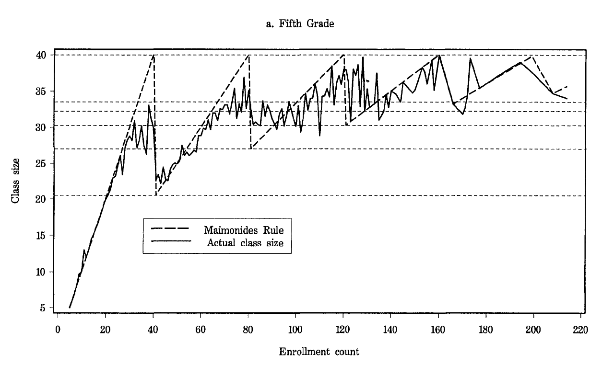

# Empirical Exercise 7

In this exercise, we'll use data from Joshua Angrist and Victor Lavy's paper 
[Using Maimonides' Rule to Estimate the Effect of Class Size on Scholastic Achievement](https://www.jstor.org/stable/2587016), 
which was published in the _Quarterly Journal of Economics_ in 1999.  The paper makes use of the fact that class size in Israeli public 
schools ise capped at 40.  Thus, if there are 40 students in a grade within a school, they are likely to be grouped into a single class; 
but if there are 41 students, the school must divide the grade into two classes taught by different teachers.  This creates a discontinuity in 
class size as a function of grade-level cohort size.  

<br>

## Getting Started

Some of the data used in the paper are available [here](E7-AngristLavy-data.html).  Download the data set and create a do file that 
reads in your data (or create a do file that reads the data directly from the web).  If you are unsure how to do this, 
go back and review some of [the earlier empirical exercises](https://pjakiela.github.io/ECON523/exercises/index.html).  

Use the `describe`, `summarize`, and `codebook` commands to familiarize yourself with the data.  How many variables are there?  What 
grade level (or levels) are included in the data set?  Use the `histogram` commands to look at the distribution of scores on the 
standardized math and reading tests (the variables `math_score` and `verbal_score`, respectively).  

Through our regression discontinuity analysis, we are interested in testing the hypothesis that smaller classes (i.e. a 
higher teacher-to-student ratio) lead to improved learning outcomes (as measured through test scores).  Before proceeding 
to that step, we can first examine the correlation between test scores and learning outcomes in the cross-section (i.e. looking at 
our entire data set, without trying to use any identification strategy).  To do this, regress `math_score` on `class_size`.  What 
is the estimated OLS coefficient?  Is it statistically significant?  Now add controls for overall cohort size (`cohort_size`), which 
proxies for the size of the school and the community it is in, the percentage of the cohort that is male (`pct_boys`), and the percentage 
of the cohort that comes from disadvantaged households (`pct_dis`).  How does the addition of these controls change the 
estimated association between class size and student test scores?

<br>

## Using Maimonides' Rule to Predict Class Size

This figure, Figure I in Angrist and Lavy's paper, summarizes their identification strategy:  cohorts that have exactly 40 students 
can be taught in a single classroom, but those that have 41 students must be split into two (smaller) classes; likewise, cohorts that have 
exactly 80 students can be divided into two classes, while cohorts with 81 students must be divided into three (smaller) classes.  This requirement 
creates the sawtooth pattern in the figure below, because class size is not a monotonic function of cohort size.


### Question 1 

We would like to recreate Figure I from Angrist and Lavy's paper.  As a first step, use the command
```
twoway scatter class_size cohort_size
```
to plot the relationship between class size and cohort size.  The `twoway` command is Stata's general tool for 
plotting the relationships between two variables, `scatter` is one of the options for types of `twoway` plots.  

When you use the command above, does your graph look like Figure I?  (A:  No, it doesn't.)  One problem is that 
we are showing too much data:  instead of plotting the values of `class_size` for every data point, we want to calculate 
the average value of `class_size` for each value of `cohort_size`.  We can use the `mean` function of the `egen` command 
to do this:
```
bys cohort_size:  egen mean_class = mean(class_size)
```
Now redo your scatter plot using `mean_class` instead of `class_size` as your dependent variable.  It 
should look better.  You can further refine your graph by playing around with the `msymbol` and `mcolor` options 
in twoway (take a look at Stata's help file for `twoway` to explore the possibilities).  You can also try making a 
`line` plot rather than a `scatter` plot using twoway.

To fully replicate Figure I from Angrist and Lavy, we need to include both the actual relationship between class size and 
cohort size (which we've done) and the relationship predicted by Maimonides' Rule.  The first step to doing this 
is to calculate the number of classes a school would need to have under Maimonides' Rule:  if the cohort size is 
between 1 and 40, the predicted number of classes is 1; if the cohort size is between 41 and 80, the predicted number of 
classes is 2; if the cohort size is between 81 and 120, the predicted number of classes is 3; and so on.  Generate a variable 
`pred_classes` using this formula.  You might want to use the `ceil()` function to do this.  Then generate a variable 
`pred_size` that is the overall cohort size divided by the predicted number of classes.  Now, you should have something that looks 
a lot like Figure I from the paper.  Make sure that all of your code for generating your figure is recorded in your do file, 
and then use the `graph export` command to save your figure so that you can upload it later.  
