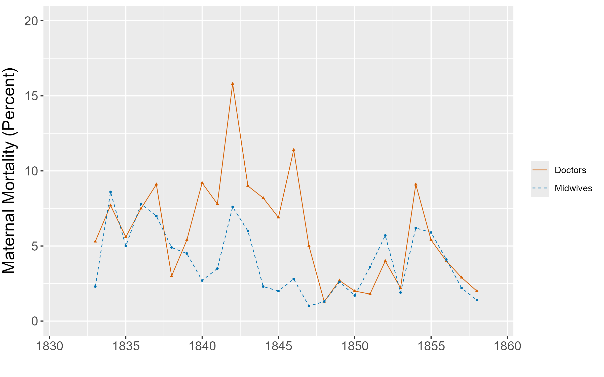

# Empirical Exercise 3 in R
   
In this exercise, we're going to analyze data from Ignaz Semmelweis' handwashing intervention in the maternity hospital in Vienna.  The data come from 
Semmelweis' (1861) book, and [some helpful person put them on Wikipedia](https://en.wikipedia.org/wiki/Historical_mortality_rates_of_puerperal_fever#Yearly_mortality_rates_for_birthgiving_women_1784%E2%80%931849).  

We'll review the different ways to estimate simple difference-in-differences models.  We'll also learn how to make simple graphs using `ggplot` and export regression results to excel using `openxls`. 
  
<br> 

## Getting Started  

Data on maternal mortality rates in Vienna are contained in the Excel file [E3-Semmelweis1861-data.xlsx](E3-Semmelweis1861-data.xlsx). The spreadsheet inlcudes annual data from 1833 (when the Vienna Maternity Hospital opened its second clinic) through 1858.  Mortality rates are reported for Division 1 
(where expectant mothers were treated by doctors and medical students) and Division 2 (where expectant mothers were treated by midwives and trainee midwives from 1841 on). In Semmelweis' difference-in-differences analysis, Division 1 was the (ever-)treated group.  

Our first task is to import this Excel file into R using the `openxlsx` package.  Create R script that begins with the usual preliminaries, installs the package `openxlsx` and loads it as one of the libraries, and then imports the Semmelweis data directly from github using the following code:
```
url <- "https://pjakiela.github.io/ECON523/exercises/E3-Semmelweis1861-data.xlsx"
e3data <- tibble(read.xlsx(url, sheet = "ViennaBothClinics"))
```
The option `sheet` tells R which worksheet within the excel file `E3-Semmelweis1861-data.xlsx` to select. After importing the data, you should observe the following columns in the `e3data` data frame:

| Columns | Description |
|------------|------------|
| Births1 | Births in Division 1 (Treatment Group) |
| Deaths1 | Deaths in Division 1 (Treatment Group) |
| Rate1 | Mortality Rate in Division 1 (Treatment Group) |
| Births2 | Births in Division 2 (Comparison Group) |
| Deaths2 | Deaths in Division 2 (Comparison Group) |
| Rate2 | Mortality Rate in Division 2 (Comparison Group) |

Now familiarize yourself with the data set. What is the average maternal mortality rate in Division 1?  What is the average maternal mortality rate in Division 2?

## In-Class Activity

### Question 1

Use R's `ggplot` package to make a graph of maternal mortality in the two wings of the hospital. First, use the following code to define the dark blue and dark orange color's from the Okabe-Ito colorblind-friendly palette
```
oiblue <- "#0072B2"
oiverm <- "#D55E00"
```
This will allow you to use the colors `oiblue` and `oiverm`, as shown in the sample code. Adapt the code to make your graph as possible to the one below.
```
ggplot(e3data, aes(x = Year, y = Rate1)) + 
  geom_point(color = oiblue, shape = 16, size = 0.8) +
  geom_line(aes(color = 'Doctors'), linewidth = 0.32) +
  geom_point(aes(y = Rate2), color = oiblue, shape = 16, size = 0.8) +
  geom_line(aes(y = Rate2, color = 'Midwives'), linewidth = 0.32) +
  xlab(" ") +
  ylab("Maternal Mortality (Percent)") + 
  scale_x_continuous(n.breaks=6) +
  scale_color_manual(name=' ',
                     breaks=c('Doctors',
                              'Midwives'),
                     values=c('Doctors' = oiverm,
                              'Midwives' = oiblue)) 
```
Your finished graph should look something like this:


What patterns do you notice in this figure?  How do maternal mortality rates in the two divisions of the hospital compare?  

### Question 2

In what year did the hospital first move to the system where patients in Division 1 were treated by doctors and patients in Division 2 were treated by midwives?  Drop the observations (years) before this happened.  

Hint: use `print(df, n = 100)` to print the first 100 rows of data frame `df`. Then use `select()` to keep the correct rows.

### Question 3

Generate a `post` variable equal to one for years after the handwashing policy was implemented (and zero otherwise).  

### Question 4

What is the mean postpartum mortality rate in the doctors' wing (Division 1) prior to the implementation of the handwashing policy?

### Question 5

Now we're going make a table showing the difference-in-differences estimate of the treatment effect of hand washing on maternal mortality. The table 
will show the mean mortality rate (maternal deaths per 100 births) in the Treatment and Comparison wings before and after Semmelweis' policy was implemented. Your table will look something like this, except with the actual means, standard errors, and differences instead of ones and zeroes:  

|             | Treatment | Comparison | Difference | 
|-------------|-----------|---------|------------|
| Before Handwashing | 1.00 | 1.00 | 1.00 |
| | (0.00) | (0.00) | (0.00) |
| After Handwashing | 1.00 | 1.00 | 1.00 |
| | (0.00) | (0.00) | (0.00) |
| Difference | 1.00 | 1.00 | 1.00 |
| | (0.00) | (0.00) | (0.00) |


We'll write to an excel file using `openxlsx` `saveWorkbook()`,  a simple command that allows you to write a data frame to an excel file.  Before getting started with `saveWorkbook()`, we will define a simple data frame that contains our desired column and row headings as well as placeholders for the results we want to report. Use the code below to do this. Notice that the second, third, and fourth columns of the tibble that we create are named **Treatment**, **Comparison**, and **Difference**.  
```
labels <- c("Before Handwashing", 
            " ", 
            "After Handwashing", 
            " ", 
            "Difference", 
            " ")
temp_column <- c("11", "00", "11", "00", "11", "00")
e3_results <- tibble(" " = labels, 
                     "Treatment" = temp_column, 
                     "Comparison" = temp_column, 
                     "Difference" = temp_column)
print(e3_results)
```

Now we use `createWorkbook()`, `addWorksheet()`, `writeData()`, and `saveWorkbook()` to write the data frame `e3_results` to excel. In addition to those key steps, the code below uses `setColWidths()` and `addStyle()` to format the table. Adjust the formatting parameters as desired. 
```
wb <- createWorkbook()
addWorksheet(wb, "Results")
# create a header style
hs1 <- createStyle(halign = "CENTER", textDecoration = "Bold", border = "BottomTop")
# write the results to the table
writeData(wb, "Results", e3_results, headerStyle = hs1)
# adjust column widths
e3_widths <- c(18, 12, 12, 12)
setColWidths(wb, "Results", cols = 1:4, widths = e3_widths)
# center the content of the table
center_style <- createStyle(halign = "CENTER")
addStyle(wb, "Results", center_style, cols = 2:4, rows = 1:7, gridExpand = TRUE, stack = TRUE)
# create a bottom border
bottom_style <- createStyle(border = "Bottom")
addStyle(wb, "Results", bottom_style, cols = 1:4, rows = 7, gridExpand = TRUE, stack = TRUE)
# save workbook
saveWorkbook(wb, file = paste0(pjpath, "/R3-DD1.xlsx"), overwrite = TRUE)
```

At this point, it is worth opening your excel file to make sure that you are writing to it successfully.  **Be sure to close the file after you look at it**; R won't write over an open excel file.  The column labels should all appear in bold font, and there should be borders at the top and bottom of the table.  

### Question 6

Now that we know the `openxls` commands are working, we can add the mean of the variable Rate1 for the years prior to the introduction of handwashing. Calculate the mean, and then use `as.character()` to convert it to a string that you call `pre_mean_1`. You can use `df[rownum, colnum]` to index a particular cell in a data frame. Update the data frame `e3_results` by replacing the appropriate cell with `pre_mean_1`, as illustrated in the code below. Then re-run the code that creates your excel workbook to see that you have successfully exported your first result.
```
pre_mean_1 <- as.character(mean(dd_data$Rate1[dd_data$Year <= 1846]))
e3_results[1, 2] <- pre_mean_1
```

### Question 7  

You **can** complete the table by calculating each statistic individually, but it is easier and faster to manipulate the data as a matrix. The code below uses `group_by()` and `summarize()` to calculate the mean, SD, and number of observations for `Rate1` and `Rate2` in the pre-treatment and post-treatment periods, and then calculates the standard error of the mean of `Rate1` as well as the standard error of the difference in means between `Rate1` and `Rate2`. Extend the code so that you also calculate the standard error of the mean of `Rate2`, and then drop the columns containing the SDs and Ns from the data frame.  
```
ddresults <- e3data %>% 
  select(Rate1, Rate2, post) %>% 
  group_by(post) %>% 
  summarise(across(where(is.numeric), .fns = 
                                        list(mean = mean,
                                             sd = sd,
                                             n = ~ n()
                                        ))) %>% 
  mutate(Rate1_se = Rate1_sd / sqrt(Rate1_n), 
         diff = Rate1_mean - Rate2_mean, 
         diff_se = sqrt(Rate1_se ** 2 + Rate2_se ** 2)) 
```

### Question 8  

We now have a data frame `ddresults` that contains six columns: three means and three standard errors. We want to create a data frame that displays the standard errors below the means. To do this, start by creating separate data frames `ddresults_mean` and `ddresults_se` that select the appropriate columns from `ddresults`.  

### Question 9  

The code below illustrates how we can add an additional row to `ddresults_se` containing the standard errors of the differences in means (pre v.s post). Implement a similar procedure to add a row containing the difference in means (pre vs. post) to the `ddresults_mean` data frame.  
```
pre_vs_post_se <- ddresults_se[1, ] ** 2 + ddresults_se[2, ] ** 2
pre_vs_post_se <- sqrt( pre_vs_post_se)
ddresults_se <- rbind(ddresults_se, pre_vs_post_se)
```

### Question 10 

Before we export our results to excel, we need to format them appropriately and convert them to strings. The code below shows how to do this for the standard errors contained in `ddresults_se`, and then illustrates how we can transfer our standard errors to the `e3_results` data frame that we intend to export to excel. Extend the code so that you also include the appropriately-formatted means in `e3_results`. Then, print `e3_results` to make sure that you are ready to write your findings to excel.

```
ddresults_se <- ddresults_se %>% 
  mutate(across(1:3, ~ sprintf("%.2f", .))) %>% 
  mutate(across(everything(), as.character)) %>% 
  mutate(across(everything(), ~ str_c("(", ., ")")))
e3_results[2, 2:4] <- ddresults_se[1, ]
e3_results[4, 2:4] <- ddresults_se[2, ]
e3_results[6, 2:4] <- ddresults_se[3, ]
```

### Question 11  

Now export `e3_results` to excel, adapting the code from Question 5. Make sure that your code now produces a correct, correctly-formatted table showing the difference-in-differences estimate of the impact of handwashing on maternal mortality.

<br>

## Empirical Exercise  

Next, we are going to implement difference-in-differences as a regression. Create a new R script file that reads in Semmelweis’ data from github and restricts attention to the period when doctors worked in the first clinic and midwives worked in the second clinic. Your script should start with the usual preliminaries, just like the one you wrote for the in-class activity.  

### Question 1

Generate a `post` variable equal to one for years after the handwashing policy was implemented (and zero otherwise), and then generate a `diff` variable equal to the difference in mortality rates between Clinic 1 (treatment) and clinic 2 (control). Regress `diff` on `post`. What is the coefficient on `post`, which is the difference-in-difference-in-differences estimate of the treatment effect of handwashing? What is the associated standard error? What is the t-statistic?  

### Question 2

Use `pivot_longer()` (illustrated below) to convert your data into a panel data set containing a variable `Rate` and a variable `clinic` that indicates whether an observation comes from Clinic 1 (doctors) or Clinic 2 (midwives).  How many observations are there in the data set now?  How many from each clinic?   
```
e3panel <- e3data %>% 
  pivot_longer(!Year, names_to = "clinic", values_to = "Rate") %>% 
  mutate(clinic = if_else(clinic == "Rate1", "1", "2"))
dim(e3panel)
```

### Question 3

Generate a `treatment` variable equal to one for the doctors' wing (and zero otherwise).  Then generate the interaction term you need to estimate a difference-in-differences model in a regression framework.

### Question 4

Question 4 is about variable labels, so not relevant if you are using R.

### Question 5

Implement (standard 2x2) difference-in-differences in an OLS regression framework. The code below will create a data frame containing the coefficients and standard errors from your regression. Adapt the code from the In-Class Activity to format the values (rounding them to two or three decimal places and then converting them to strings). What is the coefficient on your txpost (treatment x post) variable? what is the standard error?   
```
results <- model$coeftable[,1:2]
```

### Question 6

Now implement differences in differences while controlling for year fixed effects: omit the `post` variable from your regression, and use `feols` to include year fixed effects. Add your results from this regression to the `results` data frame. What is the coefficient on your `txpost` variable? what is the standard error?  Did including fixed effects improve the precision of your estimates?

### Question 7

Modify the `results` data frame so that it is ready to be exported to excel. You are free to leave the coefficients and standard errors in separate columns if you wish, but make sure to add well-formatted labels for the rows and clean up the column names.

### Question 8

When you upload your code and excel file to gradescope, you will be asked to answer the following questions about your results:
  
  - Which coefficient in the regression table (i.e. the coefficient on which variable) is the difference-in-differences estimate of the treatment effect of handwashing on maternal mortalty?
  - Which regression coefficient is the estimate of the degree of selection bias?
  - Which regression coefficient is the estimate of the time trend in the absence of treatment?
  - In one sentence, explain how adding fixed effects changed the precision of your difference-in-difference estimate of the impact of handwashing.
  
  
---

This exercise is part of [Module 3:  Difference-in-Differences 1](https://pjakiela.github.io/ECON523/M3-DD1.html).

